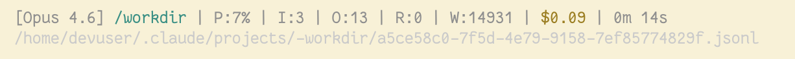

Configuration and credential files
==================================

This page describes the configuration and credential files used by the agent
tools in this repository.

Codex
-----

See :doc:`getting-started-codex` for initial setup.

- :file:`~/.codex`: Config, skills, persistent state directory. **Mounted into containers running Codex.**
- :file:`~/.codex/config.toml`: Config file
- :file:`./codex/auth.json`: Credentials

The Codex sandbox does not work well inside a container. Since we are using the
container as a security boundary, :ref:`launch` automatically includes the
``--sandbox danger-full-access`` argument. We do not suggest adding that to
your config file in case you run Codex locally, hence only adding it at run
time when launching a container.

Here is an example :file:`~/.codex/config.toml` to use.

.. code-block:: toml

   model = "gpt-5.4"
   model_reasoning_effort = "medium"
   analytics.enabled = false

   # Ask for approval on each command.
   # You can override on the command line with --ask-for-approval on-request
   approval_policy = "untrusted"

   # Shows detailed model reasoning.
   # Change to "concise" if this is too much.
   model_reasoning_summary = "detailed"

   # Less sycophantic.
   personality = "pragmatic"

   # Updates are managed through the container
   check_for_update_on_startup = false

   # Lets you keep an eye on token usage
   [tui]
   status_line = ["model-with-reasoning", "current-dir", "used-tokens", "total-input-tokens", "total-output-tokens"]

See `Codex config basics <https://developers.openai.com/codex/config-basic>`__ for more.

Claude Code
-----------

Both of these paths are **mounted into containers running Claude.**

- :file:`~/.claude/`: Config, skills, persistent state directory.
- :file:`~/.claude.json` – UI settings, metrics, and approved directories

Most of the configuration we're using for Claude Code is in the environment
variables, originally set up in :doc:`getting-started-claude`, and the
:doc:`aws-sso` setup.

:file:`~/.claude/settings.json` needs to at least exist and have an empty JSON
array in it, and :ref:`launch` sets this up by default. When you use the
:cmd:`/model` command, it will enter that choice into this file for
persistence, after which this file will look something like:

.. code-block:: json

  {
    "model": "opus"
  }

You can prevent the model from accessing paths. For example, to exclude
the :file:`data` and :file:`env` directories in the current project, you might
include this in a :file:`.claude/settings.json` in the current project:

.. code-block:: json

   {
     "permissions": {"deny": ["Read(./data)", "Read(./env)"]}
  }

If you copy the :file:`tools/claude-status.sh` file from this repo to your
:file:`~/.claude` directory, you can add the following block to
:file:`~/.claude/settings.json` to get a custom status line:

.. code-block:: json

  {
    "statusLine": {
      "type": "command",
      "command": "~/.claude/claude-status.sh"
    }
  }

Which looks like this, where:

- P: percentage of context window
- I: input tokens
- O: output tokens
- R: cache read tokens
- W: cache write tokens

See that :file:`claude-status.sh` file for tips on how to modify.

See `Claude Code Settings <https://code.claude.com/docs/en/settings>`__ for more.

AWS SSO
-------

- :file:`~/.aws`: Config directory. **Mounted into containers running Claude or Pi with Bedrock.**
- :file:`~/.aws/config`: contains profile information (SSO session & account ID)
- :file:`~/.aws/sso`: credentials for SSO

Pi
--

See :doc:`getting-started-pi` for initial setup.

- :file:`~/.pi`: Config, skill, persistent state directory. **Mounted into containers running Pi.**

See `Pi settings <https://github.com/badlogic/pi-mono/blob/main/packages/coding-agent/docs/settings.md>`__ for more.
