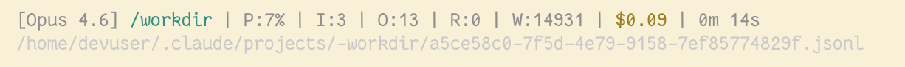

Configuration and credential files
==================================

This page describes the configuration and credential files used by the agent
tools in this repository.

.. _config-codex:

Configure Codex
---------------

See :doc:`getting-started-codex` for initial setup.

- :file:`~/.codex`: Config, skills, persistent state directory. **Mounted into containers running Codex.**
- :file:`~/.codex/config.toml`: Config file
- :file:`./codex/auth.json`: Credentials

The Codex sandbox does not work well inside a container. Since we are using the
container as a security boundary, :ref:`launch` automatically includes the
``--sandbox danger-full-access`` argument. We do not suggest adding that to
your config file in case you run Codex locally, hence only adding it at run
time when launching a container.

Here is an example :file:`~/.codex/config.toml` to use.

.. code-block:: toml

   model = "gpt-5.4"
   model_reasoning_effort = "medium"
   analytics.enabled = false

   # Ask for approval on each command.
   # You can override on the command line with --ask-for-approval on-request
   approval_policy = "untrusted"

   # Shows detailed model reasoning.
   # Change to "concise" if this is too much.
   model_reasoning_summary = "detailed"

   # Less sycophantic.
   personality = "pragmatic"

   # Updates are managed through the container
   check_for_update_on_startup = false

   # Lets you keep an eye on token usage
   [tui]
   status_line = ["model-with-reasoning", "current-dir", "used-tokens", "total-input-tokens", "total-output-tokens"]

See `Codex config basics <https://developers.openai.com/codex/config-basic>`__ for more.

.. _config-claude:

Configure Claude Code
---------------------

Both of these paths are **mounted into containers running Claude.**

- :file:`~/.claude/`: Config, skills, persistent state directory.
- :file:`~/.claude.json` – UI settings, metrics, and approved directories

Most of the configuration we're using for Claude Code is in the environment
variables, originally set up in :doc:`getting-started-claude`, and the
:doc:`aws-sso` setup.

:file:`~/.claude/settings.json` needs to at least exist and have an empty JSON
array in it, and :ref:`launch` does this automatically by default. When you use the
:cmd:`/model` command within Claude Code, it will enter that choice into this
file for persistence, after which this file will look something like:

.. code-block:: json

  {
    "model": "opus"
  }

You can prevent the model from accessing paths within the current directory.
For example, to exclude the :file:`data` and :file:`env` directories from being
read in the current project (despite the current directory being mounted in the
container), you might include this in a :file:`.claude/settings.json` in the
current project:

.. code-block:: json

   {
     "permissions": {"deny": ["Read(./data)", "Read(./env)"]}
  }

This uses the Claude sandboxing, which does not seem as robust as
containerization.

In such cases, you should probably include the directories in a ``.gitignore``
file so that when Claude runs tools like ``ripgrep`` (``rg``) then it won't
look in there either.

If you copy the :file:`tools/claude-status.sh` file from this repo to your
:file:`~/.claude` directory, you can add the following block to
:file:`~/.claude/settings.json` to get a custom status line:

.. code-block:: json

  {
    "statusLine": {
      "type": "command",
      "command": "~/.claude/claude-status.sh"
    }
  }

Which looks like this, where:

- P: percentage of context window
- I: input tokens
- O: output tokens
- R: cache read tokens
- W: cache write tokens

See that :file:`claude-status.sh` file for tips on how to modify.

See `Claude Code Settings <https://code.claude.com/docs/en/settings>`__ for more.

Configure AWS SSO
-----------------

Relevant files:

- :file:`~/.aws`: User-managed AWS config directory. It is mounted read-only
  only when an explicit, non-managed AWS profile is selected.
- :file:`~/.aws/config`: contains user-managed profile information such as SSO
  sessions and account IDs.
- :file:`~/.aws/sso`: SSO token cache, written by :cmd:`aws sso login`. It is
  used locally to refresh role credentials and is not copied to remote systems.
- :file:`~/.aws/llm-export`: managed bundle written by :ref:`refresh`. It
  contains the ``llm-export`` config and short-lived process-provider JSON and
  is mounted read-only when that managed profile is selected. Its
  :file:`config` is script-owned and is replaced in full on each export; the
  user-managed :file:`~/.aws/config` is not changed.

.. _config-aws-export:

How Bedrock credentials reach the container
~~~~~~~~~~~~~~~~~~~~~~~~~~~~~~~~~~~~~~~~~~~~

The AWS SDK running *inside* a container cannot perform an SSO login, because that
requires a browser and a localhost redirect. Such redirects to localhost do not
work in a container, nor on a remote host. Remember, we're purposefully
isolating things with containers..see :ref:`container-notes-login-model` for
more.

Since the container cannot refresh SSO credentials on its own, it needs to
access credentials that have already been handled by the local host.

To handle this, :ref:`refresh` does the following on the local host:

1. Ensures the SSO session is valid (running :cmd:`aws sso login` if needed).
2. Runs :cmd:`aws configure export-credentials --format process` to obtain the
   current short-lived role credentials (access key, secret, session token, and
   an ``Expiration``) as JSON (technically this is "process-provider" formatted
   JSON, which is what we need in this case).
3. Writes that JSON to
   :file:`~/.aws/llm-export/credentials.json`.
4. Writes the ``llm-export`` profile to
   :file:`~/.aws/llm-export/config`, whose ``credential_process`` simply
   prints that file to stdout:

   .. code-block:: ini

      [profile llm-export]
      credential_process = sh -c 'cat ~/.aws/llm-export/credentials.json'

:ref:`launch` automatically selects managed credentials (the ``llm-export``
profile). It mounts only :file:`~/.aws/llm-export` read-only, sets
``AWS_PROFILE=llm-export``, and points ``AWS_CONFIG_FILE`` at the managed
config.

Why this indirection instead of plain ``AWS_*`` environment variables?

Environment variables are fixed when the container starts and would go stale.
The AWS SDK has a `documented process credential provider
<https://docs.aws.amazon.com/sdkref/latest/guide/feature-process-credentials.html>`__
that can request credentials again when its cached credentials need refreshing.
The managed command is deliberately just ``cat`` so that this refresh is fast.

When :ref:`refresh` updates
:file:`~/.aws/llm-export/credentials.json`, the directory mount makes the new
contents available without recreating the container. SDKs and agents may cache
credentials until their normal refresh point, however. Retry the request after running :ref:`refresh`; if the agent
continues to retain expired credentials, restart the agent process inside the
container. See :ref:`ts-credentials-expired`.

When an AWS profile is selected, :ref:`launch` deliberately removes direct
access-key, secret-key, and session-token variables so stale environment
credentials cannot shadow the profile's provider. Explicit static credentials
supplied with ``--env`` are a separate supported mode and take precedence over
profile auto-selection.

Configure Pi
------------

See :doc:`getting-started-pi` for initial setup.

- :file:`~/.pi`: Config, skill, persistent state directory. **Mounted into containers running Pi.**

See `Pi settings <https://github.com/badlogic/pi-mono/blob/main/packages/coding-agent/docs/settings.md>`__ for more.
